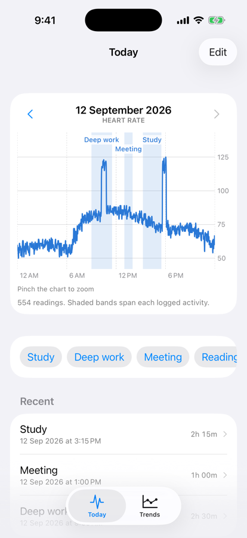

# Trace

Trace answers one question: **what is my body doing while I do the things I do?**

Apple Health already records your heart rate, HRV and resting heart rate all day.
What it has no idea about is *context* — that the hour where your heart rate sat
ten beats high was a hard debugging session, or that the calm stretch was reading.
Trace supplies the missing half: you log what you were doing, and it draws that on
top of the data Health already collected.

<p align="center">
  
</p>

<p align="center"><sub>The Today screen — heart rate across the day, with each logged activity as a band spanning its real duration.</sub></p>

## The idea

Health tracking apps tell you *what happened*. They can't tell you *why*, because
they don't know what you were doing. Every correlation you actually care about —
does studying stress me, does the afternoon meeting spike my heart rate, do I
recover on days I read — needs a label that only you can supply.

So Trace is deliberately two things and nothing else:

1. **A fast way to log an activity** — two taps, no forms, no categories to
   maintain. Start it, stop it, move on.
2. **A view that overlays those labels onto your own physiology** — the thing no
   health app can do for you, because no health app knows what you were doing.

Everything else is out of scope on purpose.

## How it works

**Logging.** Tap a label to start, tap Stop to end. The labels are six defaults
plus every label you have ever typed — type one once and it becomes a button
forever. Any past entry can be renamed, retimed, annotated or deleted.

**Today.** Your heart rate across the day, with each logged activity drawn as a
shaded band spanning its real duration. Step back through previous days with the
arrows. This is the screen the app opens on, because it is the one that answers
the question.

**Trends.** A daily *strain* score over the last 60 days, and mean strain broken
down by activity — which of the things you do line up with your harder days.

## Activities in Apple Health

A finished activity is also written to Apple Health as a **mindful session**,
carrying its label in sample metadata, so other health apps can line your
activities up against the same physiology. Editing an activity replaces that
sample and deleting one removes it, since HealthKit samples are immutable and
orphans in a health record are worse than none.

The tradeoff is the container: Mindful Minutes is the only interval-shaped slot
in Health that is not a workout, so logged study time and genuine meditation
share a bucket. That is the cost of not writing workouts — see below.

## The strain score

Apple Health has no "stress" metric. Trace derives one from the two signals that
actually track autonomic load:

- **HRV (SDNN)** — lower means more strain
- **Resting heart rate** — higher means more strain

Each is z-scored against *your own* history rather than population norms, because
absolute HRV varies enormously between people and only deviation from your own
baseline carries meaning. The two are averaged and mapped onto 0–100, where **50
is a typical day for you** and one standard deviation moves the score 20 points.

This means the score is meaningless for the first couple of weeks — there is no
baseline yet, so every day reads as typical. That is honest behaviour, not a bug.

## What it deliberately does not do

**It does not run a workout session.** A workout is the only thing that raises
heart-rate sampling from roughly one reading every 2.6 minutes to one every 5
seconds — a 30× difference, measured on real exports. The cost is that every
session becomes a permanent workout entry in Health and Fitness, and a sedentary
one distorts the Activity rings to a degree that depends entirely on the type
chosen:

- **`Other`** applies a brisk-walk floor: a full Exercise minute for every minute
  elapsed, and active calories at brisk-walk rate *or* the heart-rate-derived
  rate, whichever is higher. A two-hour study session would fabricate 120
  Exercise minutes and a calorie burn that never happened.
- **Heart-rate-estimated types** (`Yoga`, `Mind & Body`) distort far less, since
  calories follow your actual heart rate — but they are the wrong label for
  studying, and they collide with those activities if you genuinely do them.

Plus the battery cost of continuous green-LED sampling. Trace accepts coarse
sampling instead, in exchange for costing nothing to run and leaving your rings
honest. The consequence is real and worth stating: the intraday line is a sparse
connect-the-dots, and within-session detail is not recoverable afterwards — no
amount of logging recovers samples that were never taken.

**It does not guess.** No auto-detection of what you are doing, no inferred
categories, no coaching. The label comes from you or it does not exist.

**It does not leave the phone.** Activities live in a local SwiftData store and
are mirrored into Apple Health on-device. Health data is read through HealthKit
and never transmitted. There is no account, no server, no analytics.

## Correlation is not cause

Mean strain per activity is a description of days, not a verdict on them. A heavy
study day and a bad night's sleep tend to arrive together, and the chart cannot
separate them. Read it as a question worth asking, never as an answer.

## Requirements

- iPhone running iOS 18 or later
- Apple Watch, worn regularly — without one there is no HRV or heart-rate data to
  overlay and the app has nothing to show
- HealthKit permission for heart rate, HRV and resting heart rate (read only)

## Building

```sh
xcodegen generate
xcodebuild -project Trace.xcodeproj -scheme Trace \
  -destination 'id=<your-device-id>' \
  -allowProvisioningUpdates -allowProvisioningDeviceRegistration build
```

HealthKit returns no data in the Simulator, so a physical device is required to
use the app.

## Tests

```sh
xcodebuild test -project Trace.xcodeproj -scheme Trace \
  -destination 'platform=iOS Simulator,name=iPhone 17'
```

The suite runs on the Simulator — it covers pure logic, so it needs no health
data and no device:

| Suite | Covers |
|---|---|
| `DayCursorTests` | Day stepping: midnight normalisation, refusing the future, a 7-day round trip |
| `BandLayoutTests` | Clipping activities to a day: midnight crossings, zero-width bands, inverted intervals |
| `StressScoreTests` | The strain score, chiefly the cases with too little history to have a baseline |
| `ActivityTests` | The model, against an in-memory `ModelContainer` |
| `DayStepperUITests` | The day stepper driven through the real UI (XCUITest) |

`DayStepperUITests` exists because the stepper once froze for a reason no unit
test could reach: two buttons in one `List` row let the row swallow their taps.
Reverting that one fix fails three of its five cases, so it is a real regression
test rather than decoration.

What the suite still does **not** cover: the other half of that bug, where a
scrollable chart held a scroll offset pointing into the previous day's domain and
rendered blank. The date label updates correctly in that state, so no assertion
on it can catch a chart that simply drew nothing. Verifying that needs a device
and a pair of eyes.
